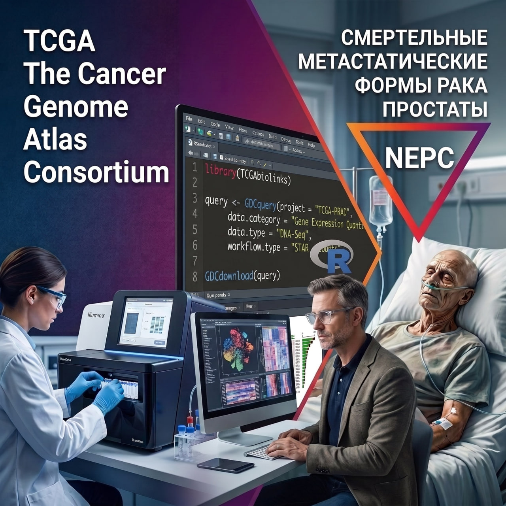

# Моя личная цифровая лаборатория по самообучению биоинформатике, исследованию рака (в первую очередь - терминальных форм рака простаты) по открытым базам данных и размышлениям с искусственным интеллектом DeepSeek и Claude Opus/Sonnet последних версий

## История создания цифровой лаборатории

Светлой памяти моего Папы, трагически погибшего в июне 2026 года в неравной схватке с метастатическим кастрат-резистентным раком предстательной железы mCRPC, резистентного после 3 лет энзалутамида и доцетаксела даже к 177Lu-ПСМА, и синхронной второй нейроэндокринной опухоли тонкой кишки с множественными метастазами в лимфоузлы и печень. Перед первым вводом 177Lu-ПСМА все многочисленные костные метастазы рака простаты показывали синхронное свечение на ПЭТ с ПСМА и DOTA-TATE, то есть он был клонально неоднороден и по-видимому готов к перерождению в агрессивную нейроэндокринную форму NEPC. Лютеций удалось сделать в Обнинске всего два раза из-за тяжёлой анемии и тромбоцитопении через 1.5 месяца после второго ввода, после чего Папу перевели обратно на антиандрогены II поколения (апалутамид).

Последние месяцы жизни после резкого роста ПСА с октября 2025 по январь 2026 года с 30 до 200 начала развиваться утрата аппетита и кахексия, таяние всех скелетных мышц. Несмотря на стабилизацию ПСА на 200 на апалутамиде. За последние полгода жизни произошёл подъём ферритина с 40 до 2000, а щелочной фосфатазы с 300 до 1200. С марта 2026 начал развиваться ДВС-синдром с обвалом фибриногена до 0.5 г/л, ростом Д-димера и сильной кровоточивостью слизистых, большими самопроизвольно возникающими синяками на теме. В апреле 2026 ПЭТ КТ с ПСМА обнаружило более 20 новых костных метастаз по сравнению с августом 2025 перед лечением 177Lu-ПСМА.

В июне Папа умер от сердечного приступа.

После этого я решил начать менять профессию из физической химии, где я защитил кандидатскую диссертацию в 2011 году и IT с 1С и сайтами на биоинформатику и мстить вычислительными методами этому злу, отнявшему у меня самого близкого человека.

Для начала я решил изучать язык программирования R и делать учебные проекты с данными из базы TCGA по локазированному раку простаты и SU2C - метастатическим. Моим первым стремлением является исследование генов связанных с кахексией в раке простаты с высоким Глисоном.

