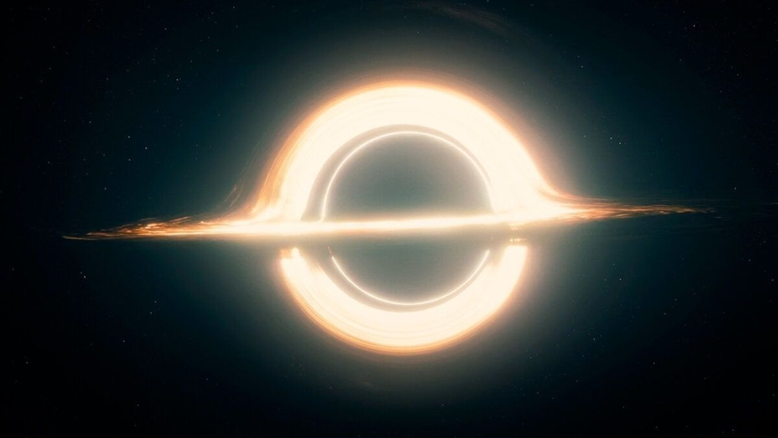

```         
Не уходи смиренно, в сумрак вечной тьмы,
Пусть тлеет бесконечность в яростном закате.
Пылает гнев на то, как гаснет смертный мир,
Пусть мудрецы твердят, что прав лишь тьмы покой.
И не разжечь уж тлеющий костёр.
Не уходи смиренно в сумрак вечной тьмы,
Пылает гнев на то, как гаснет смертный мир.

Не гасни, уходя во мрак ночной.
Пусть вспыхнет старость заревом заката.
Встань против тьмы, сдавившей свет земной.
Мудрец твердит: ночь — праведный покой,
Не став при жизни молнией крылатой.

Не гасни, уходя во мрак ночной.
Слепец прозреет в миг последний свой:
Ведь были звёзды-радуги когда-то...
Встань против тьмы, сдавившей свет земной.
Отец, ты — перед чёрной крутизной.
От слёз всё в мире солоно и свято.

Не гасни, уходя во мрак ночной.
Встань против тьмы, сдавившей свет земной.

А ты, хватавший солнце на лету
Узнай к закату дней
Что не уйдёшь безропотно во тьму…
```

Дилан Томас \| Interstellar

